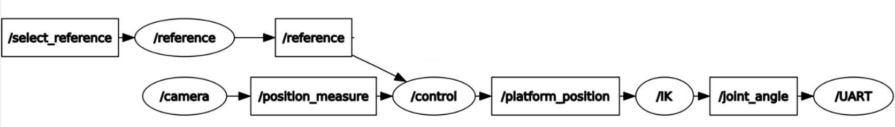
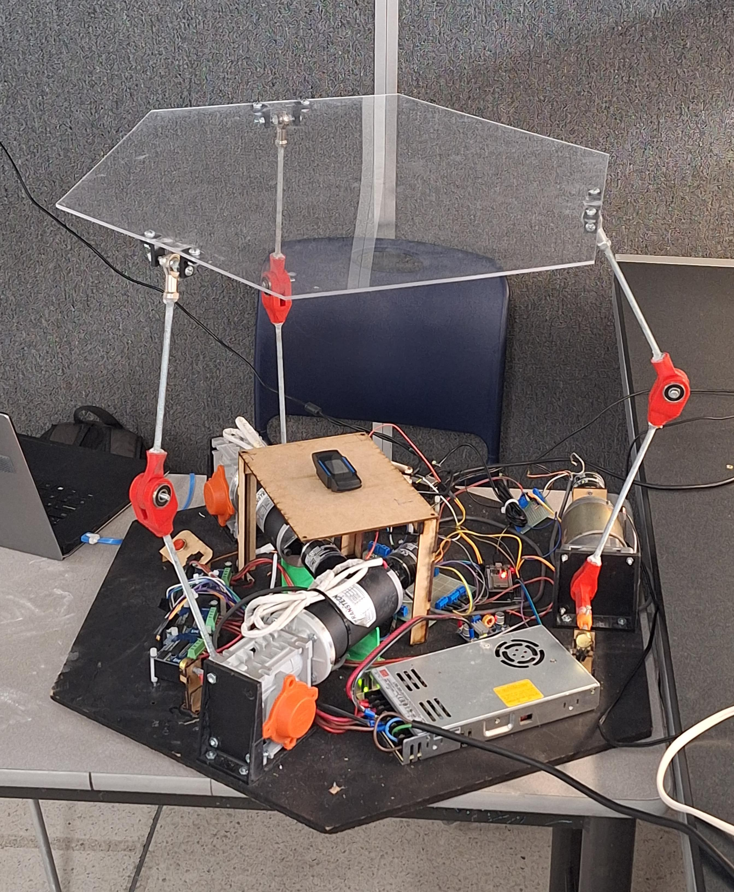

# Delta Robot Control System

This repository contains the complete code for a Delta robot control system, distributed across two platforms:

- **ESP32**: Runs local motor control using PWM and PID, with encoder feedback.
- **Jetson Nano with ROS Melodic**: Runs ROS nodes for visual processing, trajectory generation, PID control, and inverse kinematics computation.

## 🔧 Structure

### `/esp32/`
Contains the firmware uploaded to both ESP32 boards:
- `main.cpp`: Main control loop.
- `Encoder.h`: Motor and encoder interface.
- `PID.h`: PID controller implementation.

### `/jetson_nano_ros/`
Contains all ROS melodic nodes and tools:
- `IK.py`: Inverse kinematics node.
- `control.py`: ROS-based PID controller for platform motion.
- `reference.py`: Reference trajectory generator (circle, square, figure-8, etc.).
- `camera.py`: OpenCV-based vision node with two cameras for 3D ball tracking.
- `uart.py`: UART communication with ESP32.
- `UDP.py`: Sends data over UDP (optional).
- `launch.launch`: ROS launch file.

## 🖼️ System Diagram
Below is a system diagram of the platform architecture:



## ▶️ How to Run the System

### ESP32
- Upload `main.cpp` with `Encoder.h` and `PID.h` to both ESP32 boards.
- Use PlatformIO or Arduino IDE to compile and flash the firmware.

### Jetson Nano (Ubuntu 18.04 + ROS Melodic)
```bash
cd ~/catkin_ws
catkin_make
source devel/setup.bash
roslaunch jetson_nano_ros launch.launch
```

## 📸 Camera Setup
- Overhead camera (index 0): Detects (x, y) position of the ball.
- Side camera (index 1): Detects height (z) of the ball.

## 🧠 Reference Trajectories
Select the disered reference trayectory for the ball publishing in /select_reference topic:
- rostopic pub /select_reference std_msgs/Int16 "data: 3" --once

Supported trajectories include:
- Origin (0, 0, 0.4)
- Diagonal
- Circle
- Square
- Hexagon



